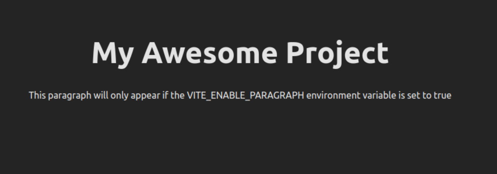
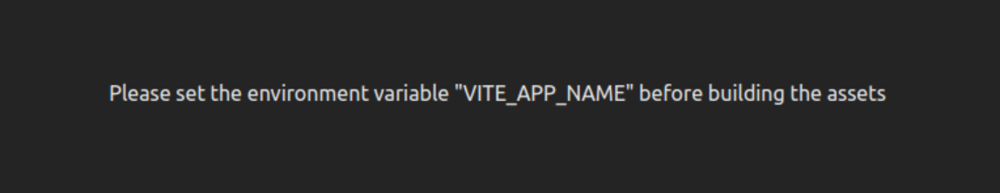
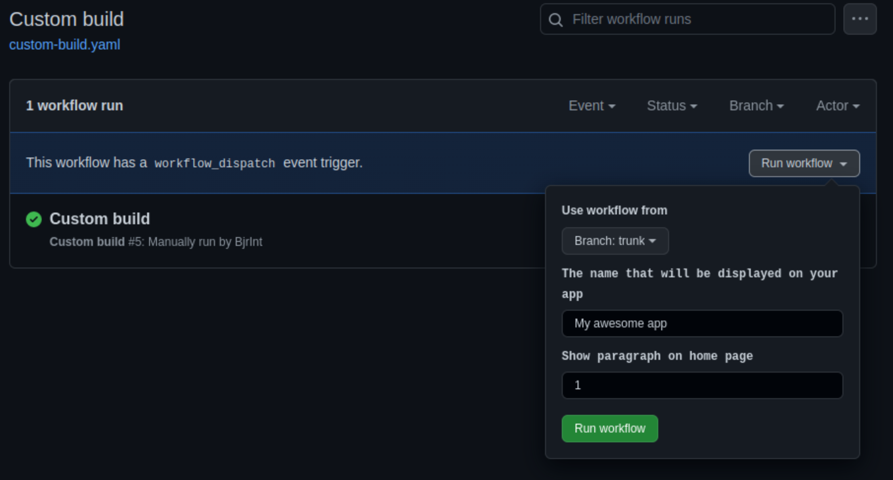

# Feature Flag Template

This repository shows how to create differentiated build of a web app, using Vite (though any other bundler will also work), from a Github action that has a feature flag setup.

## Usage

This minimal example uses 2 environment variables :

- `VITE_APP_NAME`
- `VITE_ENABLE_PARAGRAPH`

Running :

```
VITE_APP_NAME="My Awesome Project" VITE_ENABLE_PARAGRAPH="1" npm run dev
```

Will output this page:


At the contrary, if no feature flags are provided the following assets will be output


## Running inside a Github action

This repository also contains [a Github action](./.github/workflows/custom-build.yaml) allowing for remote execution, so the build can be created on demand.

The environment variable are piped at runtime in the action VM, but the results remain the same.


